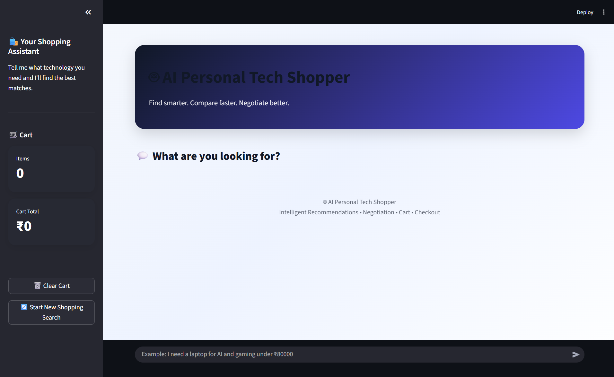
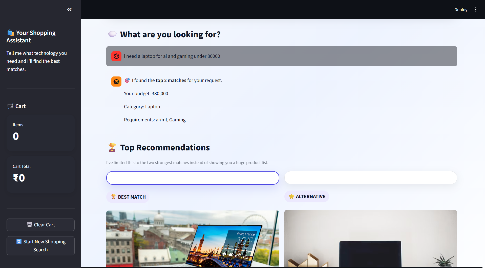
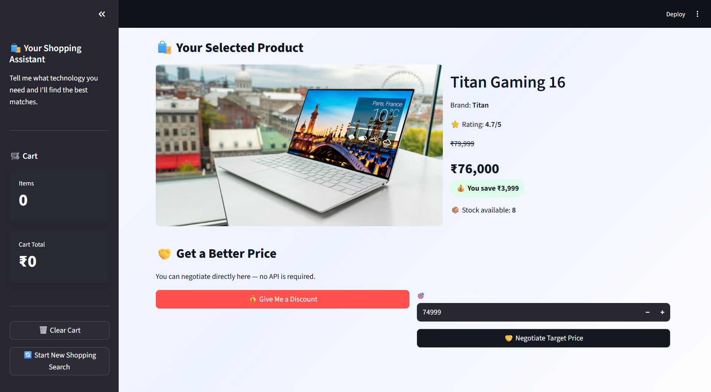
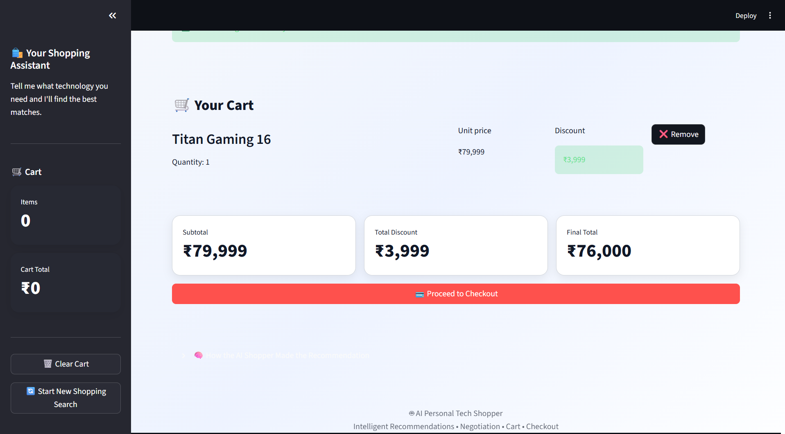
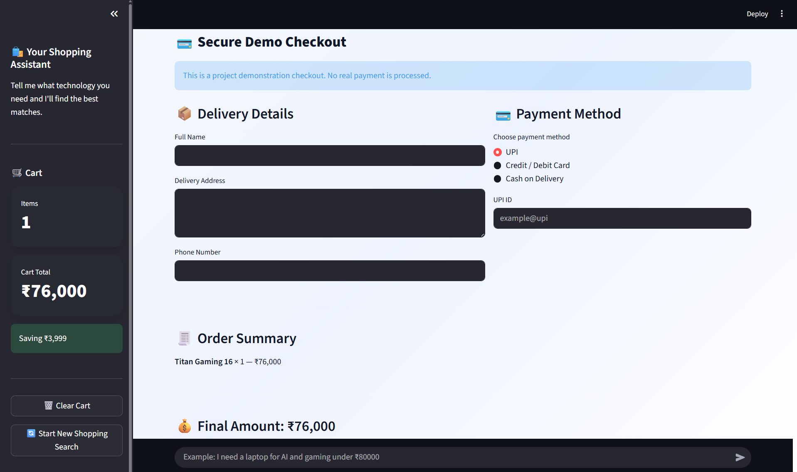
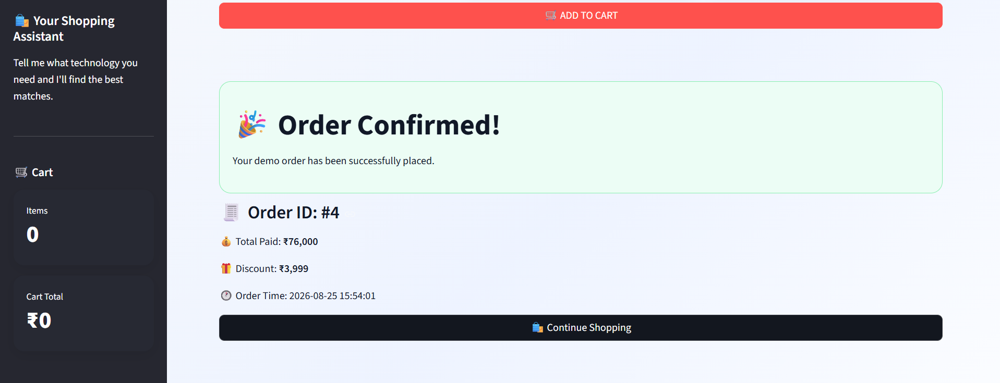

# 🤖 AI Personal Tech Shopper

An AI-powered technology shopping assistant built with Python and Streamlit.

The AI Personal Tech Shopper helps customers find suitable technology products based on their budget, requirements, and preferences. It supports product discovery, recommendations, price negotiation, discounts, shopping cart management, and checkout.

---

## 📌 Project Overview

The system works as an intelligent shopping assistant that can understand customer requests and guide them through the shopping process.

### Shopping Flow

Customer Request  
↓  
Intent Detection  
↓  
Product Search  
↓  
Product Evaluation  
↓  
Recommendation  
↓  
Price Negotiation  
↓  
Discount  
↓  
Add to Cart  
↓  
Checkout

---

## ✨ Features

### 🔎 Product Discovery

Customers can search for technology products according to their needs, including:

- Laptops
- Smartphones
- Audio products
- Gaming accessories
- Chargers
- Laptop bags

### 🤖 AI Recommendations

The system evaluates products using factors such as:

- Customer budget
- Product category
- Intended usage
- Product specifications
- Rating
- Availability

### 💰 Price Negotiation

Customers can interact with the shopping assistant to request:

- A discount
- A target price

The system evaluates the request and provides an available offer when applicable.

### 🛒 Shopping Cart

Customers can:

- Add products to the cart
- Select quantities
- Remove products
- View subtotal
- View discounts
- View final total

### 💳 Checkout

The application provides a checkout interface where customers can enter:

- Full name
- Delivery address
- Phone number

Available payment methods include:

- UPI
- Credit / Debit Card
- Cash on Delivery

### 💬 Conversational Shopping

Customers can interact with the assistant throughout the shopping process instead of using only traditional product filters.

### 📊 Analytics

The application records shopping activities such as:

- Product views
- Recommendations
- Cart actions
- Negotiations

---

## 🖥️ Technology Stack

- Python
- Streamlit
- Python modules
- Session State
- Agent-based architecture
- Product catalog
- Shopping cart management
- Analytics

---

## 📂 Project Structure

```text
AI-Tech-Shopper/
│
├── app.py
├── agent.py
├── agent_brain.py
├── agent_planner.py
├── ai_brain.py
├── analytics.py
├── cart_manager.py
├── cart_recovery.py
├── chat_agent.py
├── checkout.py
├── comparison.py
├── conversation_manager.py
├── customer.py
├── intent_engine.py
├── memory.py
├── negotiation.py
├── offers.py
├── product_details.py
├── products.py
├── recommendation.py
├── shopper.py
├── smart_recommendation.py
├── tools.py
├── tests
└── README.md
---

## 📸 Application Screenshots

### 🏠 Main Shopping Interface



### 🔎 Product Discovery



### 🤖 AI Shopping Assistant



### 🛒 Shopping Cart



### 💰 Discount & Pricing



### 💳 Checkout


